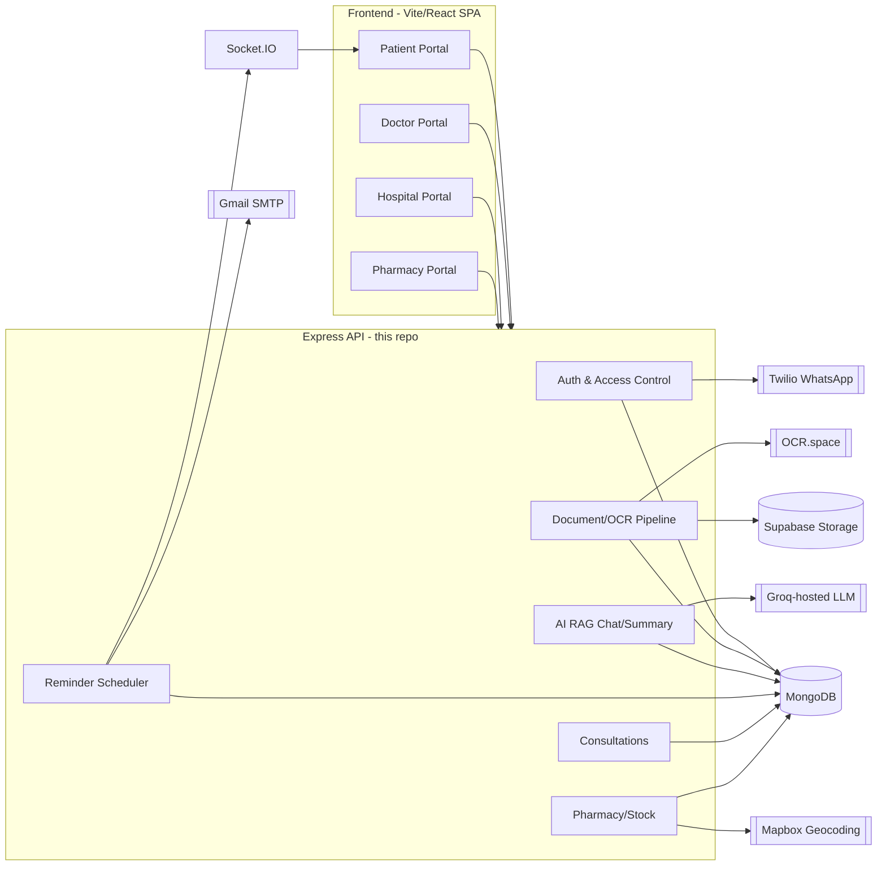

# HealSync — Architecture & System Design

> Reference document for the full stack: `backend/` (Express API) and `frontend/` (Vite/React SPA).
> Written after a stabilization pass (2026-07-14), then substantially updated after the frontend,
> Consultations module, Groq-backed AI Assistant, Pharmacy portal, and a production-hardening pass
> (rate limiting, auth-controller consolidation, initial test coverage) were added. Keep this
> updated as the system evolves — it's meant to make onboarding (including future-you) fast.

## 1. Vision

HealSync is **not** a digital locker — it's a permission-based medical data exchange connecting four
stakeholders:

- **Patients** — own a unified, encrypted health record ("wallet"), grant time-bound access to
  doctors, book consultations, get AI-summarized insights grounded in their own records, see a
  chronological health timeline, and get medication reminders.
- **Hospitals / Doctors** — request access to a patient's history (patient must approve), view/
  upload records, book/complete consultations, use AI to summarize a patient's condition.
- **Pharmacies** — publish real-time stock/price so patients can find medicine nearby (discovery,
  not an ordering/checkout flow — see §8).

Core mechanisms: a patient-owned encrypted health wallet, permission-based/time-bound access
tokens with audit logs (visible to the patient, not just captured), a medicine discovery engine, a
consultation-booking workflow, and a Groq-backed RAG AI layer (OCR + retrieval + chat) that only
ever answers from records the asker is actually authorized to see.

## 2. Tech stack

**Backend**
- **Runtime**: Node.js (ESM, `"type": "module"`), Express 4
- **Database**: MongoDB via Mongoose 8
- **Auth**: JWT (`jsonwebtoken`) + bcrypt password hashing, one shared login-controller factory
  (`middleware/authControllerFactory.js`) and one shared auth-middleware factory
  (`middleware/authFactory.js`) across all four identities
- **Realtime**: Socket.IO (reminder push notifications)
- **Scheduling**: `node-cron` (reminder checks, cleanup, recurring reminders, BP/sugar reminders —
  batched via `bulkWrite`, not per-document sequential saves)
- **File storage**: Supabase Storage (medical document uploads)
- **AI**: Groq-hosted LLM (RAG chat/summarization/document classification — permission-gated
  retrieval, no vector DB, lexical/structured retrieval instead), OCR.space (prescription OCR)
- **Other integrations**: Mapbox (pharmacy geocoding), Twilio WhatsApp (OTP for doctor access
  requests), Gmail SMTP via Nodemailer (verification/reset/reminder emails)
- **Security**: helmet, express-rate-limit (auth endpoints + AI chat endpoints have dedicated
  limiters), express-mongo-sanitize, AES-256-GCM field-level encryption for sensitive medical text
  (`utils/encryption.js`)
- **Tests**: Vitest (`backend/tests/`) — see §8

**Frontend** (`frontend/`)
- **Build**: Vite, TypeScript
- **UI**: React 19, Tailwind CSS, a small shared component library (`src/components/ui/`)
- **Data fetching**: TanStack Query (React Query) — one cache per resource, reused across pages
- **Routing**: React Router 6, route-level code-splitting (`React.lazy`/`Suspense`), a global error
  boundary (`src/components/shared/ErrorBoundary.tsx`)
- **Tests**: Vitest + React Testing Library (`src/tests/`) — see §8

## 3. System diagram



## 4. Data model

Every patient-facing record stores a `User._id` directly — **there is no separate `Patient`
collection**. This used to be a real bug (see §8): a duplicate `Patient`/`Hospital`/`Doctor` schema
set in `models/models.js` conflicted with the real `Hospital`/`Doctor` models under
`models/hospital/`, registering different schemas against the same MongoDB collections. That
duplication has been removed; `models/models.js` now only defines the schemas it's the sole owner
of (`MedicalDocument`, `MedicationSchedule`, `Notification`, `AuditLog`, `AIChatSession`).


Key collections and where they live:

| Model | File | Notes |
|---|---|---|
| `User` (patients) | `models/userModel.js` | password hashing, AES-encrypted biometric token, `otp`/`otpExpires` for doctor-access approval |
| `Doctor` | `models/hospital/doctorModel.js` | |
| `Hospital` | `models/hospital/hospitalModel.js` | 2dsphere index on `geoLocation` |
| `Pharmacy` | `models/medical/pharmacy.js` | no embedded medicine list — see §8 |
| `Medicine` / `PharmacyStock` | `models/medical/medicine.js`, `pharmacyStock.js` | the real, working inventory system |
| `PatientAccess` | `models/hospital/patientAccessModel.js` | active grant of a doctor/hospital to view a patient's records |
| `AccessToken` | `models/AccessToken.js` | QR/short-code based patient-initiated grant (TTL-indexed) |
| `FormEntry` | `models/formEntryModel.js` | patient health-questionnaire entries, AES-encrypted `data` |
| `Reminder` | `models/medical/reminder.js` | rich scheduling schema, virtual `isOverdue` |
| `BPTracking` / `SugarTracking` | `models/bp.js`, `models/sugar.js` | vitals + medication adherence tracking |
| `MedicalDocument`, `MedicationSchedule`, `Notification`, `AuditLog`, `AIChatSession` | `models/models.js` | |

All medically-sensitive text (OCR output, NLP summaries, form-entry data, biometric tokens) is
encrypted at the Mongoose schema level (`pre("save")`/`post("find")` hooks) using AES-256-GCM via
`utils/encryption.js`, keyed by the single `ENCRYPTION_KEY` env var.

## 5. Auth & access control

Four independent JWT-based identities: `User` (patient), `Doctor`, `Hospital`, `Pharmacy` — each
with its own signup/verify/login/forgot-password/reset-password flow (`controllers/authentication*`,
`controllers/authentication_hos_doc/*`, `controllers/pharmacy/*`). Two layers are now consolidated
into shared factories instead of four near-identical copies each:

- **Auth middleware** (JWT verify → load identity → attach to `req`): `controllers/authorization.js`,
  `middleware/doctorAuthorize.js`, `middleware/hospitalAuthorize.js`,
  `controllers/pharmacy/pharmacyAuthorizer.js` are thin wrappers around
  `middleware/authFactory.js`'s `createAuthMiddleware({ Model, reqKey, role, ... })` — one JWT-verify
  implementation, one token secret source, one `passwordChangedAt`-revocation check. Each still
  attaches to a different `req` key (`req.user`, `req.doctor`, `req.hospital`) matching what every
  controller already expects. `middleware/identifyActor.js` is a generic variant that tries `User`
  then `Doctor` for endpoints usable by either, built on the same factory's shared
  `verifyBearerToken()` step.
- **Login controllers** (email+password check → JWT issue): `controllers/authentication/login.js`,
  `controllers/authentication_hos_doc/doctorLogin.js`/`loginHospital.js`,
  `controllers/pharmacy/loginPharmacy.js` are now built on
  `middleware/authControllerFactory.js`'s `createLoginController({ Model, notRegisteredMessage,
  extraJwtClaims, successMessage })` — each role file is just its own error copy and JWT-claim
  shape, not a duplicated lookup/compare/sign implementation. Signup and forgot-password/
  reset-password controllers are **not yet** consolidated onto a factory — still four near-identical
  copies each; a reasonable next target if they keep needing synchronized changes.

`/login` and `/sign-up` (all four roles) and the AI chat endpoints (`POST /api/chat`,
`POST /api/doctor/chat`) sit behind dedicated `express-rate-limit` limiters
(`middleware/rateLimiters.js`) — separate from the looser global request ceiling — since brute-force
login attempts and uncapped calls to a paid hosted LLM were the two highest-risk unbounded-cost
surfaces in the app.

**Doctor access to a patient's records is one system with three grant methods.** Every method ends
up writing the same `PatientAccess` record (`patientId`, `doctorId`, `expiresAt`, `isActive`), and
every grant/revoke/approve action is logged the same way via `utils/activityLogger.js` →
`AccessActivityLog`. There's no separate access model per method — only the *entry point* differs:

1. **Doctor requests → patient approves (OTP)** — `controllers/doctor/requestAccessByDoctor.js`
   (doctor, `doctorAuthorize`) looks up the patient by phone, sends a 6-digit OTP over WhatsApp
   (Twilio, falls back to console-logged OTP in dev), and creates an *inactive* `PatientAccess`
   with the doctor's stated `reason`. `controllers/access/approveDoctorRequest.js` (doctor submits
   the OTP the patient received — only the patient could have given it to them, which is the
   "approval") verifies it against `User.otp`/`otpExpires` and flips `isActive: true`.
2. **Patient generates a token → doctor enters it** — `controllers/access/generateAccessToken.js`
   (patient) creates an `AccessToken` (`shortCode` + `token`, both valid). `controllers/access/
   claimAccess.js` (doctor) accepts **either** `token` or `shortCode` in the request body — same
   endpoint serves manual entry — and upserts an active `PatientAccess`.
3. **Patient generates a QR → doctor scans it** — the same `AccessToken` from method 2 also encodes
   a `qrDataUrl`; scanning it opens `controllers/access/scanWeb.js` (public claim-info page), whose
   "Claim Access" button hits the same `claimAccess.js` endpoint with the token. Methods 2 and 3 are
   the same backend flow with two different ways of getting the token into the doctor's hands.

There's also `grantAccessByPhone.js` — a fourth, simpler convenience path (patient directly grants a
doctor found by phone, no request/OTP/claim round-trip) that writes to the same `PatientAccess`
model and logs the same way. Not one of the three primary methods, but consistent with the same
underlying system.

**Booking a consultation also silently grants the doctor a 7-day `PatientAccess` window**
(`controllers/consultation/bookConsultation.js`, `reason: "Consultation booking"`), so the doctor
can review records before/after the appointment. This is now surfaced to the patient in two places
so it isn't a silent grant in practice: an info notice on the booking drawer
(`frontend/src/features/consultations/BookConsultationDrawer.tsx`) and a "From a consultation
booking" badge on the grant itself in Access & Sharing
(`frontend/src/features/access/SharingPage.tsx`).

**Patients can see who accessed their records.** `middleware/documentAccess.js`'s
`auditDocumentAccess` writes every document-view event to `AuditLog`; `GET /api/audit/mine`
(`controllers/audit/getMyAuditLog.js`) reads it back in patient-friendly form on the Access &
Sharing page — the data was always captured but used to go nowhere the patient could see.

An older, now-removed duplicate of method 1 (`requestAccess.js`/`approveRequest.js`) used to exist
and was genuinely broken (its own code comments admitted `PatientAccess` was never created) — it's
been deleted; `requestAccessByDoctor.js`/`approveDoctorRequest.js` is the only method-1 implementation.

Every `PatientAccess` grant is `view`-only: a doctor/hospital can view existing records and upload
new ones, but never edit or delete existing patient data (enforced in
`controllers/doctor/updatePatientRecord.js`, `formEntry` controllers).

`middleware/documentAccess.js` gates the doctor/hospital document routes
(`GET /api/documents/patient/:patientId`, `GET /api/documents/hospital/patient/:patientId`) by
checking for a live `PatientAccess` grant matching the requester, and persists an audit trail to
the `AuditLog` collection.

## 6. Folder structure

```
/README.md               Project overview, points here
/ARCHITECTURE.md          This file
/backend/
  app.js                  Express app assembly (middleware, route mounting)
  server.js               Process entry point (env validation, DB connect, HTTP+socket listen, graceful shutdown)
  configure/              DB connection, Supabase client, env validation
  routes/                 One file per resource, thin — delegates to controllers
  controllers/            Business logic, grouped by domain (authentication, doctor, pharmacy, access, consultation, audit, timeline, ...)
  middleware/             authFactory.js + authControllerFactory.js (shared auth logic), rateLimiters.js, document-access checks
  models/                 Mongoose schemas
  service/                External integrations (email, JWT, geocoding, socket, reminder scheduler, ai/ — Groq RAG pipeline)
  utils/                  Cross-cutting helpers (encryption, OTP, QR, cronJobs/, cloud upload)
  tests/                  Vitest — auth factory, PatientAccess authorization gate, date-boundary utils
  docs/                   Historical/detailed docs (encryption, access control, reminders, security audits)
  .env.example            Source of truth for required environment variables
/frontend/
  src/
    api/                  One file per backend resource — thin axios wrappers, always return `.data.data` shape
    features/             One folder per page/domain (dashboard, vitals, consultations, doctor/, pharmacy/, timeline/, ...)
    components/ui/        Shared design-system primitives (Button, Card, Alert, EmptyState, ...)
    components/shared/    Cross-feature composites (ErrorBoundary, CriticalInfoBanner, StatCard, ...)
    context/               Auth, Theme, Toast, Socket providers
    routes/                ProtectedRoute (auth gate), RoleRoute (role gate), nav.tsx (per-role nav config)
    tests/                 Vitest + React Testing Library — route guards
    App.tsx                Route table (lazy-loaded per page for code-splitting)
```

Run the backend with `cd backend && npm install && npm run dev`; the frontend with
`cd frontend && npm install && npm run dev` (see root `README.md`).

Routes stay thin and delegate to controllers, except `routes/documentAI.js`, which currently
defines its upload handlers inline rather than delegating — inconsistent with the rest of the
codebase but not broken; worth refactoring later for consistency.

**Production-process concerns**: `server.js` handles `SIGTERM`/`SIGINT` by closing the HTTP server
and the Mongoose connection before exiting (with a forced-exit timeout fallback), rather than dying
mid-request. `controllers/Error/globalErrorhandler.js` translates Mongoose's own error types
(`CastError`, duplicate-key `11000`, `ValidationError`) into clean 400/409 responses instead of
leaking raw internal messages as generic 500s — errors thrown as `CustomError` elsewhere are
unaffected. `utils/cronJobs/` holds all background jobs: the reminder scheduler's own checks
(`service/reminderScheduler.js`), the BP/sugar medication-intake reminder
(`BPSugarReminder.js`), and `patientAccessCleanup.js`, which daily deactivates any `PatientAccess`
grant whose `expiresAt` has passed (mirrors the TTL index `AccessToken` already has, since
`PatientAccess` itself isn't TTL-indexed).

## 7. API map

All routes are mounted under `/api`. Grouped by domain (method — path — auth):

**Auth** (`/api/auth`) — patient signup/verify/login/forgot-password/reset-password (`/login`, `/sign-up` rate-limited)
**User functions** (`/api/user`) — BP and Sugar tracking CRUD (auth required)
**Reminders** (`/api/reminders`) — full CRUD + `/upcoming`, `/stats`, `/:id/complete`, `/:id/dismiss` (auth required)
**Notifications** (`/api/notifications`) — in-app notification feed (auth required)
**Consultations** (`/api/consultations`) — patient booking (`/`, `/mine`, `/:id/cancel`), doctor management (`/doctor-list`, `/:id/complete`) — completing one auto-grants a 7-day `PatientAccess`
**Audit** (`/api/audit`) — `/mine` (patient-visible "who accessed your records" log)
**Timeline** (`/api/timeline`) — `/mine` (chronological merge of readings/documents/consultations/form entries)
**Documents** (`/api/documents`, `/api/documents/ai`) — patient CRUD (auth + ownership check, paginated `?page&limit`), doctor/hospital view (auth + `PatientAccess` check), AI upload/OCR pipeline
**Form entries** (`/api/form-entry`) — patient health questionnaire CRUD
**Chat** (`/api/chat`) — patient AI chat; (`/api/doctor` `POST /chat`) — doctor AI chat, both backed by Groq and rate-limited
**Hospital** (`/api/hospital`) — signup/verify/login/reset (rate-limited), doctor management (`/create-doctor`, `/doctors*`), `/me`, `/doctor-stats`
**Doctor** (`/api/doctor`) — signup/verify/login/reset (rate-limited), `/me`, `/chat`
**Doctor access** (`/api/doctor-access`) — `/patient/:id/records`, `/patient/:id/update` (view-only, edits rejected), `/request-access` (method 1, step 1)
**Access control** (`/api/access`) — `/generate` + `/claim` (methods 2 & 3), `/grant-by-phone`, `/approve-doctor-request` (method 1, step 2), `/list`, `/revoke`, `/revoke-token`, `/activity-logs`, `/pending-requests`, public `/scan` claim page (method 3)
**Pharmacy** (`/api/pharmacy`) — signup/verify/login/reset (rate-limited), `/nearby` (public), `/pharmacy/:id` (public), `/me`, `/stats`, stock CRUD (`/stock*`, auth required)
**Medicine** (`/api/medicine`) — `/search-nearby` (**public** — medicine name + optional lat/lng/radius → nearby pharmacies with price/quantity), catalog CRUD (pharmacy auth required)
**Health check** — `GET /api/health`

## 8. Known limitations / remaining work

- **Signup and forgot-password controllers are not yet consolidated onto a factory** — login and
  reset-password (doctor/hospital) both are now (§5, `middleware/authControllerFactory.js`'s
  `createLoginController`/`createResetPasswordController`). Signup (`createUser.js`,
  `doctorRegister.js`, `createHospital.js`, `pharmacy/register.js`) and forgot-password
  (`password.js`, `doctorForgotPassword.js`, `hospitalForgotPassword.js`, `pharmacy/
  forgotPassword.js`) remain four near-identical copies each — a reasonable next target. Patient
  and pharmacy's reset-password controllers also weren't migrated onto the new factory since they
  each carry extra legacy-HTML-form behavior the doctor/hospital ones don't.
- **`controllers/pharmacy/functionality/nearestWithStock.js` is redundant with the public
  `/api/medicine/search-nearby` endpoint** but still sits behind `pharmacyAuth` for no functional
  reason (it never reads `req.user`). Not broken, just superseded — worth removing to avoid two
  ways to do the same query.
- **The API response envelope is normalized for the highest-traffic controllers**
  (`documentController.js` now returns `{status, message, data}` matching `CustomError`'s shape;
  `middleware/authControllerFactory.js` does the same) but not repo-wide — a long tail of older
  controllers still return `{success, data}` or `{ok, answer}`. Migrate file-by-file as they're
  touched rather than as one large sweep.
- **Multer is on the deprecated 1.x line** (`multer@1.4.5-lts.2` — install warns of known
  vulnerabilities patched in 2.x). 2.x has API differences; upgrade as a dedicated task.
- **No request-validation layer beyond what Mongoose enforces at the model level** — no
  `express-validator`/`Zod`/similar for per-route input shape checks. Worth adding incrementally on
  new/high-traffic endpoints rather than retrofitting everything at once.
- **No centralized config module or logging library.** `process.env.X` is read ad hoc throughout
  the codebase (required vars are validated once at startup via `configure/validateEnv.js`), and
  all logging is raw `console.log`/`console.error` with no levels or structured output.
- **`unhandledRejection` is intentionally non-fatal** (logs, doesn't exit) because several
  controllers still aren't uniformly wrapped in try/catch — exiting the whole process on any one of
  them would be too fragile without a process supervisor (PM2/systemd/Docker restart policy) in
  front of it. Revisit once one is in place.
- **JWTs are long-lived with no refresh-token rotation and no logout-side revocation** — a leaked
  token stays valid until it expires or the password changes. Reasonable for the current stage, a
  real gap for a "commercial healthcare platform" framing.
- **Test coverage is intentionally narrow, not exhaustive.** Backend: `backend/tests/` covers the
  auth login factory, the `PatientAccess` authorization gate (`verifyAuthorizedAccess` — the single
  most load-bearing security check in the app), and the BP/Sugar daily-intake-reset date-boundary
  logic — verified end-to-end for all four roles (signup → verify → login → forgot-password →
  reset → login) via manual scripted runs, though not (yet) as a committed automated test. Frontend:
  `frontend/src/tests/` covers `ProtectedRoute`/`RoleRoute`. Not covered by automated tests: signup/
  reset-password flows, the three doctor-access grant methods end-to-end, consultation booking, the
  AI RAG pipeline, or most page-level UI. Extend incrementally — the goal was "the highest-risk path
  has a safety net," not full coverage.
- **Pharmacy is discovery-only by design** (§1) — no ordering/checkout/payment flow. A consultation's
  prescription links out to the same nearby-pharmacy search (`/app/pharmacy?q=...`), but the patient
  still has to call the pharmacy themselves. This is a deliberate scope boundary, not an oversight;
  revisit only as a deliberate product decision.
- **File upload validation checks MIME type only, not file content** (`service/multer.js`) — a
  client can spoof `Content-Type` to get a disguised file past the filter. Size limit (20MB) and
  server-side temp-path sanitization (`path.basename()` on the client-supplied filename — fixed
  after a real path-traversal finding) are enforced correctly; content-sniffing (e.g. a magic-byte
  check via a library like `file-type`) is not. Worth adding if file uploads become a larger attack
  surface than they are today.
- **The Supabase Storage bucket for medical documents is public** (`utils/uploadToCloud.js`) —
  anyone with a document's URL can view it without authentication; the app's own permission checks
  never gate the file itself, only the metadata record and the URL's discoverability. Storage keys
  are now randomly generated (`crypto.randomUUID()`, not the guessable `Date.now()-filename` they
  used to be), which closes off enumeration, but the bucket is still public by configuration. The
  correct long-term fix is a private bucket with short-lived signed URLs generated per request —
  deferred because it touches every document read path (list, detail, AI OCR/retrieval) and needs
  testing against a real Supabase project to get the expiry/refresh behavior right.
- **No PDF export, full accessibility pass, or i18n.** A first accessibility pass landed this
  session (`Field`/`Tooltip` in `components/ui/` now auto-wire `id`/`htmlFor` and forward
  `aria-label` to icon-only controls, cascading to every call site), but a full keyboard-nav/screen-
  reader audit hasn't been done. All three are genuinely valuable, reasonable to defer further.
- **External integrations need real credentials** to verify end-to-end: Supabase (document
  storage), Twilio (WhatsApp OTP — falls back to console-logged OTP without it), OCR.space
  (prescription OCR), Mapbox (pharmacy geocoding), Gmail SMTP (all outbound email), Groq (AI chat —
  falls back to a graceful "having trouble connecting" message without it). All fail gracefully
  (clear errors, not crashes) when unconfigured; see `.env.example`.

## 9. Environment variables

See `backend/.env.example` and `frontend/.env.example` — they're the source of truth and kept in
sync with what the code actually reads. Backend vars required to boot at all: `MONGO_URI`,
`JWT_SECRET`, `SALTROUNDS`, `ENCRYPTION_KEY` (validated at startup in `configure/validateEnv.js` —
the server refuses to start without them). Everything else (Groq, Supabase, Twilio, Mapbox,
OCR.space, Gmail SMTP) degrades gracefully per-feature when unset. The frontend only needs
`VITE_API_URL` if not proxying through Vite's dev-server config (see `frontend/vite.config.ts`).

## 10. Recommended next steps

1. **Private Supabase bucket + signed URLs** (§8) — the highest-value remaining security fix; needs
   a real Supabase project to test the expiry/refresh behavior against, which is why it wasn't
   attempted blind in this pass.
2. **Consolidate signup/forgot-password controllers** onto a factory, mirroring the login/
   reset-password consolidation in §5 — the next-highest-leverage backend refactor.
3. **Get real credentials** for Supabase, Gmail, Twilio, Mapbox, OCR.space, and Groq in any
   environment that needs to exercise those flows end-to-end (dev already has working defaults for
   most of these; double-check before deploying).
4. **Expand test coverage** past the current narrow set (§8) — signup flows, the three doctor-access
   grant methods, consultation booking, and RAG retrieval are the next-highest-value targets.
5. **JWT refresh-token rotation + logout revocation** if/when the token-lifetime gap (§8) becomes a
   real concern for the deployment target.
6. **Magic-byte file-content validation** on uploads (§8) if file uploads become a larger attack
   surface than they are today — MIME-type checking alone can be spoofed client-side.
