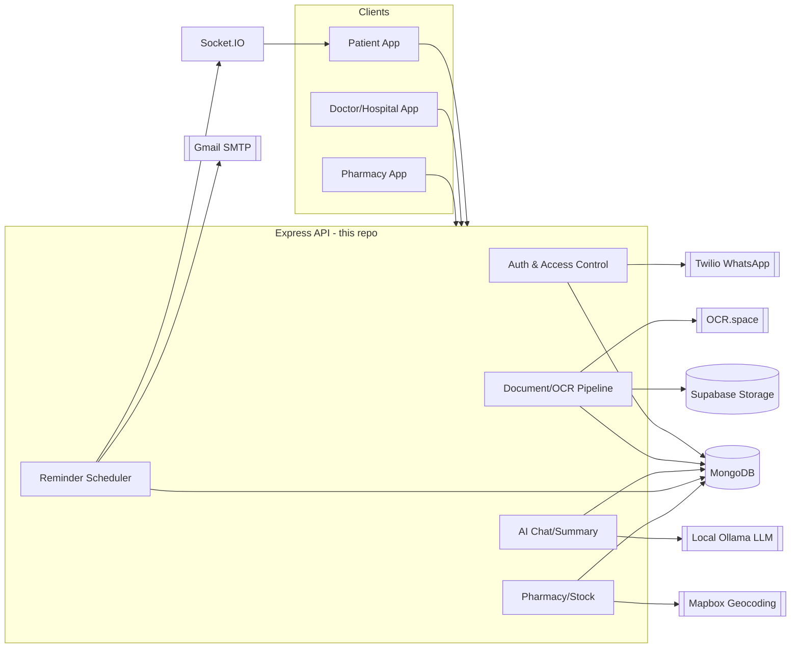
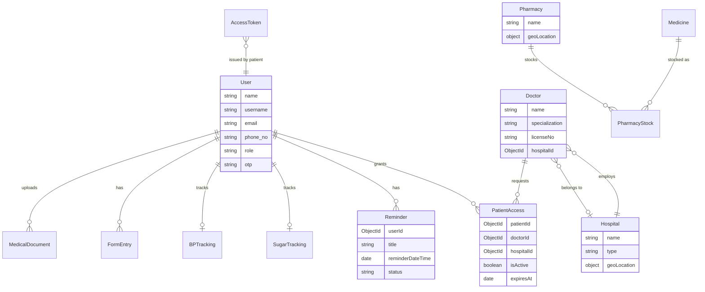

# HealSync — Architecture & System Design

> Reference document for the backend, which lives under `backend/` in this repo. Written after a
> stabilization pass (2026-07-14) that fixed the issues described in "Known Limitations" below, and
> updated after a repo restructure into the `backend/` layout. Keep this updated as the system
> evolves — it's meant to make onboarding (including future-you) fast.

## 1. Vision

HealSync is **not** a digital locker — it's a permission-based medical data exchange connecting three
stakeholders:

- **Patients** — own a unified, encrypted health record ("wallet"), grant time-bound access to
  doctors, get AI-summarized insights, and get medication reminders.
- **Hospitals / Doctors** — request access to a patient's history (patient must approve), view/
  upload records, use AI to summarize a patient's condition.
- **Pharmacies** — publish real-time stock/price so patients can find medicine nearby.

Core mechanisms: a patient-owned encrypted health wallet, permission-based/time-bound access
tokens with audit logs, a medicine discovery engine, and an AI layer (OCR + summarization) built on
a local LLM (Ollama).

## 2. Tech stack

- **Runtime**: Node.js (ESM, `"type": "module"`), Express 4
- **Database**: MongoDB via Mongoose 8
- **Auth**: JWT (`jsonwebtoken`) + bcrypt password hashing
- **Realtime**: Socket.IO (reminder push notifications)
- **Scheduling**: `node-cron` (reminder checks, cleanup, recurring reminders, BP/sugar reminders)
- **File storage**: Supabase Storage (medical document uploads)
- **AI**: local Ollama LLM (chat/summarization/document classification), OCR.space (prescription OCR)
- **Other integrations**: Mapbox (pharmacy geocoding), Twilio WhatsApp (OTP for doctor access
  requests), Gmail SMTP via Nodemailer (verification/reset/reminder emails)
- **Security**: helmet, express-rate-limit, express-mongo-sanitize, AES-256-GCM field-level
  encryption for sensitive medical text (`utils/encryption.js`)
- **Frontend**: none yet — see §9.

## 3. System diagram



## 4. Data model

Every patient-facing record stores a `User._id` directly — **there is no separate `Patient`
collection**. This used to be a real bug (see §8): a duplicate `Patient`/`Hospital`/`Doctor` schema
set in `models/models.js` conflicted with the real `Hospital`/`Doctor` models under
`models/hospital/`, registering different schemas against the same MongoDB collections. That
duplication has been removed; `models/models.js` now only defines the schemas it's the sole owner
of (`MedicalDocument`, `MedicationSchedule`, `Notification`, `AuditLog`, `AIChatSession`).



Key collections and where they live:

| Model | File | Notes |
|---|---|---|
| `User` (patients) | `models/userModel.js` | password hashing, AES-encrypted biometric token, `otp`/`otpExpires` for doctor-access approval |
| `Doctor` | `models/hospital/doctorModel.js` | |
| `Hospital` | `models/hospital/hospitalModel.js` | 2dsphere index on `geoLocation` |
| `Pharmacy` | `models/medical/pharmacy.js` | no embedded medicine list — see §8 |
| `Medicine` / `PharmacyStock` | `models/medical/medicine.js`, `pharmacyStock.js` | the real, working inventory system |
| `PatientAccess` | `models/hospital/patientAccessModel.js` | active grant of a doctor/hospital to view a patient's records |
| `AccessToken` | `models/AccessToken.js` | QR/short-code based patient-initiated grant (TTL-indexed) |
| `FormEntry` | `models/formEntryModel.js` | patient health-questionnaire entries, AES-encrypted `data` |
| `Reminder` | `models/medical/reminder.js` | rich scheduling schema, virtual `isOverdue` |
| `BPTracking` / `SugarTracking` | `models/bp.js`, `models/sugar.js` | vitals + medication adherence tracking |
| `MedicalDocument`, `MedicationSchedule`, `Notification`, `AuditLog`, `AIChatSession` | `models/models.js` | |

All medically-sensitive text (OCR output, NLP summaries, form-entry data, biometric tokens) is
encrypted at the Mongoose schema level (`pre("save")`/`post("find")` hooks) using AES-256-GCM via
`utils/encryption.js`, keyed by the single `ENCRYPTION_KEY` env var.

## 5. Auth & access control

Four independent JWT-based identities: `User` (patient), `Doctor`, `Hospital`, `Pharmacy` — each
with its own signup/verify/login/forgot-password/reset-password flow (`controllers/authentication*`,
`controllers/authentication_hos_doc/*`, `controllers/pharmacy/*`) and its own auth middleware
(`controllers/authorization.js`, `middleware/doctorAuthorize.js`, `middleware/hospitalAuthorize.js`,
`controllers/pharmacy/pharmacyAuthorizer.js`). `middleware/identifyActor.js` is a generic variant
that tries `User` then `Doctor` for endpoints usable by either.

**Doctor access to a patient's records is one system with three grant methods.** Every method ends
up writing the same `PatientAccess` record (`patientId`, `doctorId`, `expiresAt`, `isActive`), and
every grant/revoke/approve action is logged the same way via `utils/activityLogger.js` →
`AccessActivityLog`. There's no separate access model per method — only the *entry point* differs:

1. **Doctor requests → patient approves (OTP)** — `controllers/doctor/requestAccessByDoctor.js`
   (doctor, `doctorAuthorize`) looks up the patient by phone, sends a 6-digit OTP over WhatsApp
   (Twilio, falls back to console-logged OTP in dev), and creates an *inactive* `PatientAccess`
   with the doctor's stated `reason`. `controllers/access/approveDoctorRequest.js` (doctor submits
   the OTP the patient received — only the patient could have given it to them, which is the
   "approval") verifies it against `User.otp`/`otpExpires` and flips `isActive: true`.
2. **Patient generates a token → doctor enters it** — `controllers/access/generateAccessToken.js`
   (patient) creates an `AccessToken` (`shortCode` + `token`, both valid). `controllers/access/
   claimAccess.js` (doctor) accepts **either** `token` or `shortCode` in the request body — same
   endpoint serves manual entry — and upserts an active `PatientAccess`.
3. **Patient generates a QR → doctor scans it** — the same `AccessToken` from method 2 also encodes
   a `qrDataUrl`; scanning it opens `controllers/access/scanWeb.js` (public claim-info page), whose
   "Claim Access" button hits the same `claimAccess.js` endpoint with the token. Methods 2 and 3 are
   the same backend flow with two different ways of getting the token into the doctor's hands.

There's also `grantAccessByPhone.js` — a fourth, simpler convenience path (patient directly grants a
doctor found by phone, no request/OTP/claim round-trip) that writes to the same `PatientAccess`
model and logs the same way. Not one of the three primary methods, but consistent with the same
underlying system.

An older, now-removed duplicate of method 1 (`requestAccess.js`/`approveRequest.js`) used to exist
and was genuinely broken (its own code comments admitted `PatientAccess` was never created) — it's
been deleted; `requestAccessByDoctor.js`/`approveDoctorRequest.js` is the only method-1 implementation.

Every `PatientAccess` grant is `view`-only: a doctor/hospital can view existing records and upload
new ones, but never edit or delete existing patient data (enforced in
`controllers/doctor/updatePatientRecord.js`, `formEntry` controllers).

`middleware/documentAccess.js` gates the doctor/hospital document routes
(`GET /api/documents/patient/:patientId`, `GET /api/documents/hospital/patient/:patientId`) by
checking for a live `PatientAccess` grant matching the requester, and persists an audit trail to
the `AuditLog` collection.

## 6. Folder structure

The whole Express API lives under `backend/` (repo root is reserved for project-level docs, ready
for a future `frontend/` sibling):

```
/README.md               Project overview, points here and to backend/
/ARCHITECTURE.md          This file
/backend/
  app.js                  Express app assembly (middleware, route mounting)
  server.js               Process entry point (env validation, DB connect, HTTP+socket listen)
  configure/              DB connection, Supabase client, env validation
  routes/                 One file per resource, thin — delegates to controllers
  controllers/            Business logic, grouped by domain (authentication, doctor, pharmacy, access, ...)
  middleware/             Auth guards, document-access checks
  models/                 Mongoose schemas
  service/                External integrations (email, JWT, geocoding, socket, reminder scheduler)
  utils/                  Cross-cutting helpers (encryption, OTP, QR, cron jobs, cloud upload)
  docs/                   Historical/detailed docs (encryption, access control, reminders, security audits)
  .env.example            Source of truth for required environment variables
```

Run it with `cd backend && npm install && npm run dev` (see root `README.md`).

Routes stay thin and delegate to controllers, except `routes/documentAI.js`, which currently
defines its upload handlers inline rather than delegating — inconsistent with the rest of the
codebase but not broken; worth refactoring later for consistency.

## 7. API map

All routes are mounted under `/api`. Grouped by domain (method — path — auth):

**Auth** (`/api/auth`) — patient signup/verify/login/forgot-password/reset-password
**User functions** (`/api/user`) — BP and Sugar tracking CRUD (auth required)
**Reminders** (`/api/reminders`) — full CRUD + `/upcoming`, `/stats`, `/:id/complete`, `/:id/dismiss` (auth required)
**Documents** (`/api/documents`, `/api/documents/ai`) — patient CRUD (auth + ownership check), doctor/hospital view (auth + `PatientAccess` check), AI upload/OCR pipeline
**Form entries** (`/api/form-entry`) — patient health questionnaire CRUD
**Chat** (`/api/chat`) — patient AI chat; (`/api/doctor` `POST /chat`) — doctor AI chat, both backed by local Ollama
**Hospital** (`/api/hospital`) — signup/verify/login/reset, doctor management (`/create-doctor`, `/doctors*`)
**Doctor** (`/api/doctor`) — signup/verify/login/reset, `/me`
**Doctor access** (`/api/doctor-access`) — `/patient/:id/records`, `/patient/:id/update` (view-only, edits rejected), `/request-access` (method 1, step 1)
**Access control** (`/api/access`) — `/generate` + `/claim` (methods 2 & 3), `/grant-by-phone`, `/approve-doctor-request` (method 1, step 2), `/list`, `/revoke`, `/revoke-token`, `/activity-logs`, `/pending-requests`, public `/scan` claim page (method 3)
**Pharmacy** (`/api/pharmacy`) — signup/verify/login/reset, `/nearby` (public), `/pharmacy/:id` (public), stock CRUD (`/stock*`, auth required)
**Medicine** (`/api/medicine`) — `/search-nearby` (**public** — medicine name + optional lat/lng/radius → nearby pharmacies with price/quantity), catalog CRUD (pharmacy auth required)
**Health check** — `GET /api/health`

## 8. Known limitations / remaining work

These were intentionally **not** fixed in the stabilization pass — they're feature/design decisions,
not bugs with an obvious single fix, or they need credentials this environment doesn't have:

- **`controllers/pharmacy/functionality/nearestWithStock.js` is redundant with the new public
  `/api/medicine/search-nearby` endpoint** but still sits behind `pharmacyAuth` for no functional
  reason (it never reads `req.user`). Left as-is since it's not broken, just superseded for the
  public use case — worth removing later to avoid two ways to do the same query.
- **`todaysIntake` (BP/Sugar medication adherence counter) has no daily-reset logic.** The field now
  persists correctly (it didn't before), but nothing resets it to 0 at the start of a new day, so
  once a patient hits their daily tablet count the reminder logic won't fire again on later days.
- **`scanWeb.js`'s public claim page** shows patient name/phone/emergency info to anyone with the
  link before it's claimed by a doctor, despite the code comment calling it "one-time" — the token
  is only actually consumed later, at claim time. Minor PII-exposure design question worth revisiting.
- **Ollama is a hard local runtime dependency** for all AI chat/summary/document-classification
  features — nothing in the code degrades gracefully if it's not installed/running beyond returning
  a "having trouble connecting" fallback message. No hosted-LLM fallback exists.
- **No automated tests.** `package.json`'s `test` script is still the CRA placeholder.
- **Multer is on the deprecated 1.x line** (`multer@1.4.5-lts.2` — install warns of known
  vulnerabilities patched in 2.x). Left alone in this pass since 2.x has API differences; upgrade
  as a dedicated task.
- **`unhandledRejection` is intentionally non-fatal** (logs, doesn't exit) because several
  controllers still aren't uniformly wrapped in try/catch — exiting the whole process on any one
  of them would be too fragile without a process supervisor (PM2/systemd/Docker restart policy) in
  front of it. Revisit once one is in place.
- **External integrations need real credentials** to verify end-to-end: Supabase (document
  storage), Twilio (WhatsApp OTP — falls back to console-logged OTP without it), OCR.space
  (prescription OCR), Mapbox (pharmacy geocoding), Gmail SMTP (all outbound email). All fail
  gracefully (clear errors, not crashes) when unconfigured; see `.env.example`.
- **The Mailtrap sandbox credentials that used to be hardcoded in `service/email.js` are already in
  git history.** They've been replaced with Gmail SMTP env vars, but since this was a sandbox
  Mailtrap account (not a real production secret) and the repo is private, this is low-urgency —
  rotate/forget them at your convenience, no action required.

## 9. Environment variables

See `backend/.env.example` — it's the source of truth and is kept in sync with what the code
actually reads. Required to boot at all: `MONGO_URI`, `JWT_SECRET`, `SALTROUNDS`, `ENCRYPTION_KEY`
(validated at startup in `configure/validateEnv.js` — the server refuses to start without them).
Everything else degrades gracefully per-feature when unset.

## 10. Recommended next steps

1. **Start frontend work.** Recommendation: React (matches the blueprint and the existing
   `FRONTEND_URL`-based CORS/Socket.IO setup) with a thin API client layer against the endpoint map
   in §7. Socket.IO is already initialized server-side for real-time reminder push — wire up a
   client listener early since it's the one piece of realtime UX in the app.
2. **Get real credentials** for Supabase, Gmail, and at least one of Twilio/Mapbox/OCR.space to
   unblock end-to-end testing of document upload, email, geocoding, and OCR.
3. **Stand up Ollama locally** (or decide on a hosted LLM alternative) to exercise the AI chat/
   summary features — they're currently unverified beyond "does it return a graceful fallback."
4. **Add automated tests**, starting with the auth flows, the `PatientAccess` authorization check
   in `middleware/documentAccess.js`, and the three doctor-access grant methods (§5).
